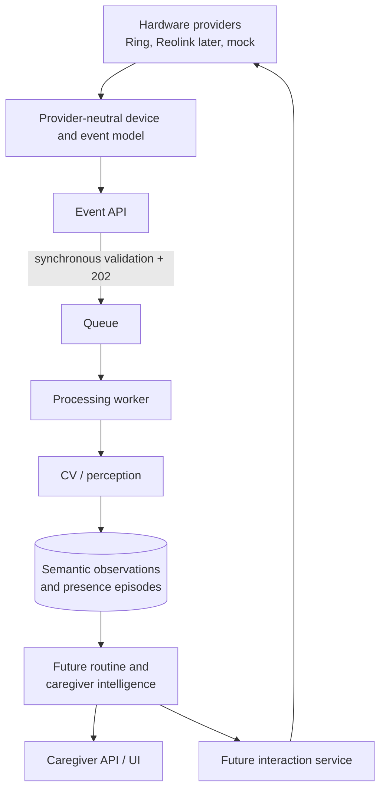

# Architecture



Only validation, authorization and enqueueing are synchronous. The worker is at-least-once and `Observation` has a unique event ID, making duplicate delivery safe. Provider media is processed temporarily; the durable record is a semantic observation, presence episode, and processing measurement rather than a raw-video archive.

## Boundaries

`CameraProvider` is the current provider boundary for camera/event media. Its `CameraDevice` is household-scoped and carries the provider device ID, logical room, and capability metadata. This is intentionally the shared physical-device identity: the same device can participate in observation today and interaction later. `CameraEvent`, `Observation`, `PresenceEpisode`, residents, caregivers, and household membership all use the same domain and persistence model.

Perception owns decoding, person/pose detection, short-term within-clip tracking, and conservative body-state evidence. It does not identify residents from a box, diagnose conditions, or issue an emergency/fall claim. The semantic domain owns durable, provider-neutral facts such as presence evidence and room-level episodes. The future intelligence layer will derive routine baselines, deviations, and caregiver summaries from those facts rather than asking an LLM to perceive video frame by frame.

The future interaction boundary is deliberately not implemented yet:

```text
caregiver intelligence / scheduler / caregiver command
        → interaction service
        → interactive-device provider
        → shared household device + room
        → Reolink, audio node, or future hardware
```

The existing capability object (`video`, inbound/outbound audio, full-duplex talk, PTZ, streaming, and event clips) is provider-owned metadata, not a promise that any vendor supports a feature. Audio Spike 1 must verify a concrete Reolink model and firmware before an interaction-provider interface or protocol abstraction is added. Ring remains replaceable behind the provider boundary and must not be assumed to permit application-controlled outbound speaker audio.
