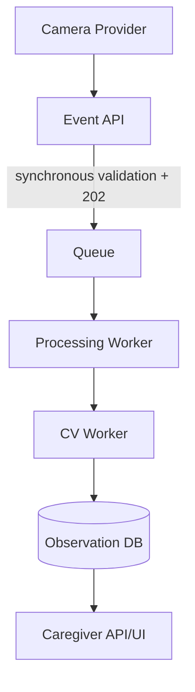

# Architecture

Only validation, authorization and enqueueing are synchronous. The worker is at-least-once and Observation has a unique event ID, making duplicate delivery safe. Providers expose capabilities through the domain package; downstream code only sees `CameraProvider`.
